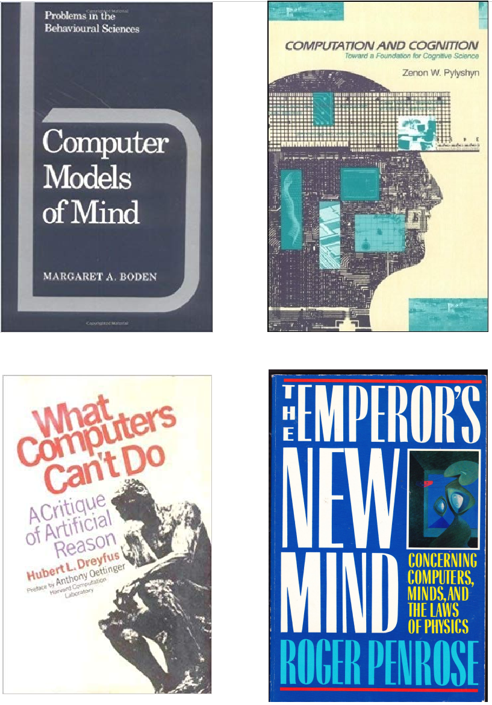
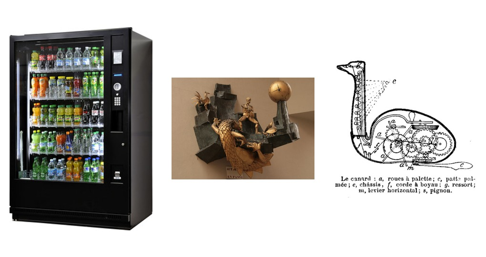
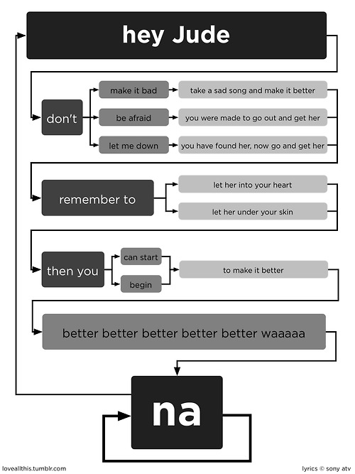
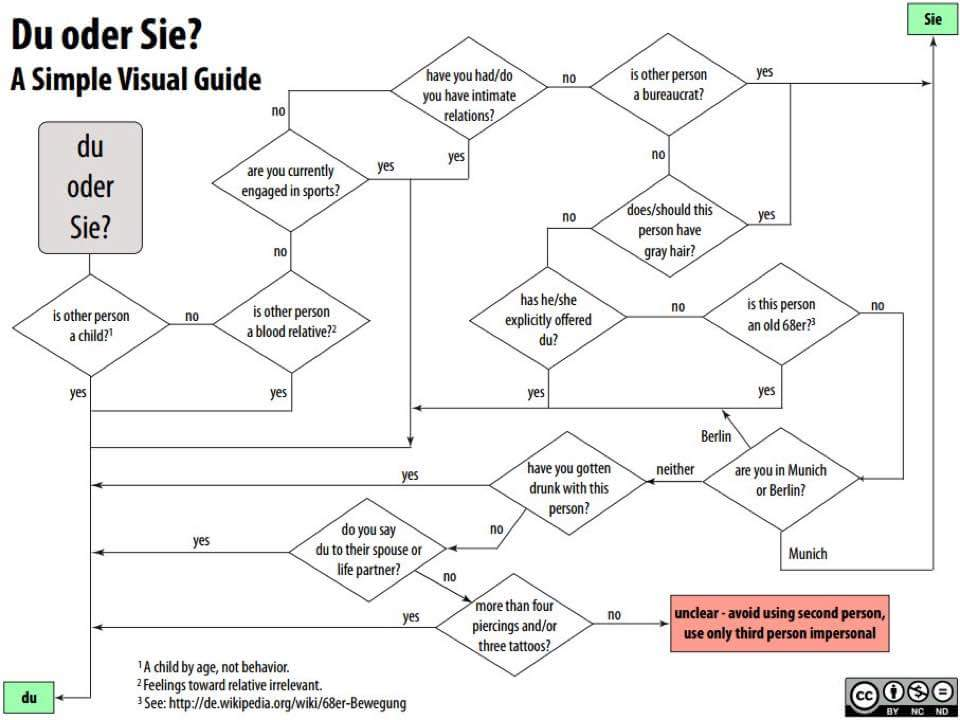
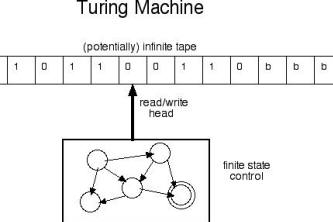
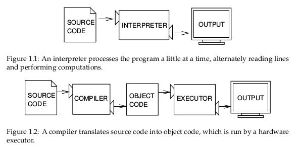
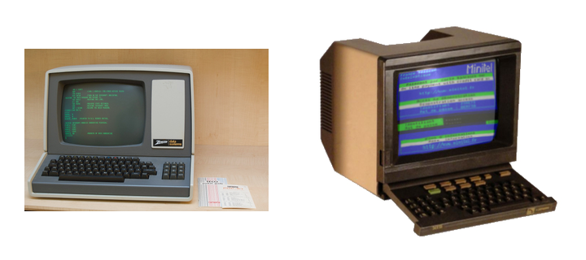
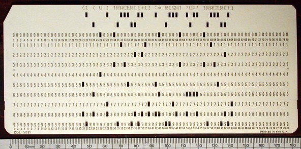
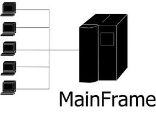
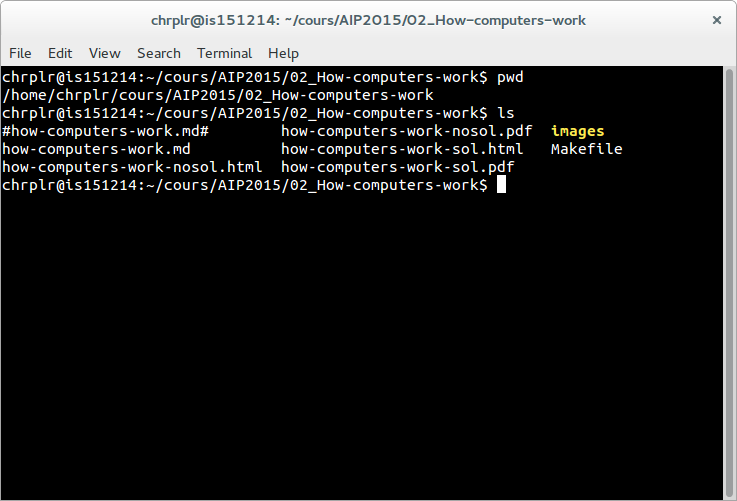

% Automata, Turing Machines and Computers
% Christophe Pallier
% Sep. 2018

# The Computational Theory of Mind

Cognitive science founding disciplines :  

* Psychology 
* Linguistics
* Philosophy of mind
* Neurosciences
* Computer science (Cybernetics + AI)

Could a machine think? Could the mind itself be a machine?

Computers were designed to simulate the mental operations realized by a human mathematician performing a... computation  (see Alan Turing)

The _Computational Theory of Mind_  has been defended and attacked many times. 




More readings: 

* Zylberberg, Ariel, Stanislas Dehaene, Pieter R. Roelfsema, and Mariano Sigman. 2011. “The Human Turing Machine: A Neural Framework for Mental Programs.” _Trends in Cognitive Sciences_

* Van Gelder, Tim. 1995. “What Might Cognition Be, If Not Computation?:” _Journal of Philosophy_ 92 (7): 345–81. 

* Jerry Fodor _The Mind does not work that way_

* Douglas Hoftstader _Gödel, Escher & Bach_, _I am a strange loop_

## What is computation anyway ? 

One common answer is: "Computation is what a ****Turing machine** can do** 

But what is a Turing machine? 


# The ancestors of the computer: the automata

An **automaton** is a device designed to automatically follow a predetermined sequence of operations.



(see Descartes' *Les Animaux Machines*  [Lettre au Marquis de Newcastle](http://www.ac-grenoble.fr/PhiloSophie/logphil/oeuvres/descarte/newcastl.htm)


# Formal description of an automaton

At a abstract level, an automaton can be formally described by:

- a set of internal **states**
- a **transition** table (or diagram) that describes the **events** that lead to changes from one state to the other  state.


# Examples of transition diagrams

 





 


---

A Finite State Automaton can be used to generate or recognize regular languages.

In Formal Language Theory, a language is a set of strings.

Examples:

* { a, aa, ab, ba, aab, bab, ...}
* { ha!, haha!, hahaha!, hahahaha!, ...}
* { ab, aabb, aaabbb, ... }
* { the set of grammatical English sentences}


# What is a Computer?

A computer is basically an automaton augmented with a _memory store_.

This is particularly clear in the case of the _Turing machine_, a mathematical model of computation (Turing offered the Turing machine as an analysis of the activity of an (idealised) human mathematician engaged in computing).





A Turing machine is a finite state machine augmented with a tape and a mechanism to read/write on it. 

Read [Roger Penrose's chapter's on Turing machines](documents/Penrose_Turing-machines.pdf) and  <https://en.wikipedia.org/wiki/Turing_machine>. You may laos read the [Alan Turing's seminal paper](https://londmathsoc.onlinelibrary.wiley.com/doi/pdf/10.1112/plms/s2-42.1.230).


---

Other computing machines have been invented, yet: 

"All attempts to give an exact analysis of the intuitive notion of an effectively calculable function have turned out to be equivalent, in the sense that each analysis offered has been proved to pick out the same class of functions, namely those that are computable by Turing machine.

The concept of effective calculability has turned out to be formalism-independent, in that all these different formalisms pick out exactly the same class of functions." (B. Jack Copeland "The Church-Turing thesis" in _Stanford Encyclopedia of Philosophy Archive_)

Another computing model which is closer to actual computers, is the  _register machine_.

# Register machines

Read  [The seven secrets of computer power revealed](documents/Dan_Dennett-The_seven_secrets_of_computers_revealed.pdf)_ (Chapter 24 from Daniel Dennett's _Intuition Pumps and other tools for thinking_)


The RogRego computer possesses:

- a bank of registers, or memory locations, each with a unique _address_ (1, 2, 3, ...), and each able to have, as _content_, a single integer (0, 1, 2, ...)
- a processing unit can execute instructions in a stepwise, one-at-a-time fashion. The processor knows only 3 instructions:

   - **End**: finishes the programs
   - **Increment register**  with 2 arguments: a register #, an step number
   - **Decrement register and Branch** with 3 arguments, a register number and two step numbers.

An online demo is available at http://proto.atech.tufts.edu/RodRego/

You can enter the following program "ADD[0,1]", on a machine where  Reg0 contains 4 and Reg1 contains 7. Try to explain what it is doing.

    1 DEB 0 2 3
    2 INC 1 1
    3 END


. . .

This program adds the content of register 0 to register 1 (destroying the content of 0)

. . .

Exercice: write a program Program 2 "MOVE[4,5]" that moves the content of reg4 intro reg5

. . .

	1 DEB 5 1 2
	2 DEB 4 3 4
	3 INC 5 2
	4 END

. . .


Program 3 "COPY[1,3]" copies the content of reg1 into reg3, leaving reg1 unchanged:

	1 DEB 3 1 2
	2 DEB 4 2 3
	3 DEB 1 4 6
	4 INC 3 5
	5 INC 4 3
	6 DEB 4 7 8
	7 INC 1 6
	8 END

Program 4 (NON DESTRUCTIVE ADD[1,2,3]):

	 1 DEB 3 1 2
	 2 DEB 4 2 3
	 3 DEB 1 4 6
	 4 INC 3 5
	 5 INC 4 3
	 6 DEB 4 7 8
	 7 INC 1 6
	 8 DEB 2 9 11
	 9 INC 3 10
	10 INC 4 11
	11 DEB 4 12 13
	12 INC 2 11
	13 END

. . .

Note that _conditional branching_ is the key instruction that gives the power to the machine. Depending on the content of memory, the machine can do either (a) or (b). 

# The Seven secrets of computers revealed

1. Competence without comprehension. A machine can do perfect arithmetic without having to comprehend what it is doing.

2. What a number in a register stands for depends on the program

3. The register machine can be designed to discriminate any pattern that can be encoded with numbers (e.g. figures, text, sensory inputs,...)

4. Programs can be encoded by numbers.

5. All programs can be given a unique number which can be treated as a list of instructions by a Universal Machine.

6. all improvements in computers over Turing machine (or Register machine), are simply ways of making them faster

7. There is no secret #7

# Programmable computers

* The first computers were not programmable. They were hardwired! 

* An important milestone was the invention of the _programmable_ computer: 

    - a program is a set of instructions stored in memory.
    - Loaded and executed by a processor. 
    - Such programs are written in machine langage (the language of the processor)


# Compilation and interpretation

  Programs written in higher-level languages (rather than Machine language) can be either:
  
  -  **compiled**, or
  -  **interpreted**

  In both cases, you write the program as text files called **source files**.

  A **compiler** translates the program into an executable file in machine language. The executable file is standalone, that is, the source code is not needed.

  An **interpreter** reads the file and execute the commands one by one. It is slower, but easier to interact with. Disatvantage: you need the interpreter to exectute it.



# Operating systems

In the first computers, there was only **one** program running. One would load the program into memory, then run it until it halted. Several Programs were ran in _batch mode_, in a sequence.

Then, it was realized that computers could _time-share_ between programs, allowing several users (or programs) to share the computer.

This requires an **operating systems** (O.S.). The O.S. is the first program that loads into the computer during the boot. When running:

* The OS controls the hardware (screen/printer/disk/keybord/mouse,...) (drivers) 

* The OS manages all the other programs (processes/tasks/applications).
    * sharing memory
	* allocating processors and cores
	* allocating time 
  
    Check out _Task Manager_ (Windows)/_System Monitor_ (Linux)/ _Activity Monitor_ (Mac)


Different OSes offer different "views" of the computer (e.g. 1 button mouse in Mac, 2 in Windows, 3 in Linux), so often programs are designed to work on one OS (bad!). Prefer multiplatform software (like Python).

Several OS can be installed in a given machine: 

- choice at boot (multiboot)
- an OS can run inside a **virtual machine**, that is a program running in another (or the same) OS, and emulating a full computer.


* * * * *

# What is a Terminal?



**Terminal** (or **console**):  originaly, a device comprising a keyboard and screen, allowing a human to *interact* with a computer. 

Remarks:

Before keyboards and screens, there were punchcards and printers:



Histoically, terminals used to be a dumb screen/keyboard connected to a central computer.



- With the advent of _Personal Computers_, the terminal and the computer became a single apparatus.

However, terminals can be *virtual*. A terminal is a program that let you run text programs. You interact by typing and displaying text. No graphical interface/no mouse.

When you open a terminal, a program called a **shell** is started that displays a prompt, and waits for you to enter commands with the keyboard.





---------------------

# How to open a Terminal

- Ubuntu-Linux: Ctrl-Alt-T (see <https://help.ubuntu.com/community/UsingTheTerminal>)

- MacOSX: Open Finder/Applications/Utilities/Terminal (see <http://www.wikihow.com/Get-to-the-Command-Line-on-a-Mac>)

- Windows: Launch Anaconda Prompt


# The shell

Inside the terminal, you are interacting with a program called a **Shell**.

Various *Shells* exists: under Windows: cmd/powershell; under, Mac/linux: bash/tsch... they speak slighlty different languages.

The shell displays a prompt and waits for you to type commands that it will execute. For example, if you type ipython, it will start the ipython program.

One issue is that you have to know the available commands and the language.
By contrast with a Graphical User Interface shell with
Windows/Icons/Menus, **Textual shells** have a very poor ergonomy. Yet, there are more powerful. They provides variables, loops,... to facilitate automation of tasks.

For example, to create 20 directories in a single bash command under linux:

    for f in 01 02 03 04 05 06 07 08 09 10; do mkdir -p subject_$f/data subject_$f/results; done


To learn more, see Wikipedia's article on  *Shell_(Computing)*: <http://en.wikipedia.org/wiki/Shell_%28computing%29>


Good news: you will not need to learn a *shell* language, only a few commands (pwd/cd/ls/dir) to allow you to navigate the filesystem and run a program.


* * * * *

# Disks, Directories and files

Most computers (not all) have two kinds of memories: 
- volatile, fast, memory, which is cleared when the computer is switched off (processor's caches, RAM)
- 'permanent', slow, memory, which is not erased when the computer is switched off (DISKS, Flashdrives (=solid-state drives))

The unit of storage is the **file**. 

Files are nothing but blobs of bits stored "sequentially" on disks. 

A first file could be stored between location 234 and 256, a second file could be stored at location 456.

# filenames, directory structure

To access a file,  one would need to know its location on the disk.
To simplify human users' life, the OS provide a system of "pointers", that is **filenames** , organised in directories. 

To help users further, the directories are organised in a hierarchical structure: a directory can contain filenames and other (sub)directories. The top-level directory is called the **root**. 


To locate a file, you must know:

- its location in the directory structure
- its basename

Remark: a given file can have several names in the same or various directories (remember: a filename is nothing but a link between a human readable charachter string to a location on the disk)


# Working directory. Absolute pathnames vs. relative pathnames (..)

It would be tedious to always have to specify the full path of a files (that is, the list of all subdirs from the root)

Here comes the notion of **working directory**: A running program has a working directory and filenames can specified **relative** to this directory.

Suppose you want to access the file pointed to by `/users/pallier/documents/thesis.pdf`. If the current working directory is `/users/pallier`, you can just use `documents/thesis.pdf` (notice the absence of '/' at the beginning).

To determine the current working directory, list its content, and change it:

- under bash

```
	 pwd
	 ls
	 cd Documents
```

- under Windows/cmd

```
	 echo %cd%
	 dir
	 cd Documents
```
	

- under python (or ipython):


```
	import os
	os.getcwd()
	os.listdir('.')
	os.chdir('documents')
	os.getcwd()
```

	
	
# What is the PATH?

A command can simply be a program's name. Typing it and pressing Enter will start the program.

The shell knows where to look for programs thanks to a special environment variable called the **PATH**. 


Under bash

```
	echo $PATH
	which ls
	which python
```


Under Windows/DOS:

```
	echo %PATH%
```
	


The PATH variable lists all the directories that contains programs.

It is possible to add new directories to the PATH variable, to access new programs.

bash

	export PATH=newdirectory:$PATH


DOS

	PATH=newdirectory;%PATH%


# What is a library (or module/package)?

A set of new functions that extend a language (.DLL (Windows);.a or .so (Linux); framework bundles (MacOs))

Dynamic libraries can be used simultaneously by several processes. 

Eg. the function @@sqrt@@ can be defined once, and called by several programs, saving memory.  

In Python, use @@import library


	import math
	math.srqt(2)

