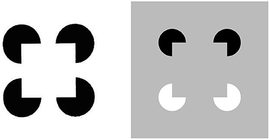
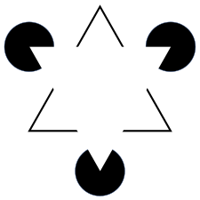

% Programming for Cognitive and Brain Sciences (notes for the Cogmaster's PCBS course) 
% Christophe Pallier
% Fall 2018

The latest version of this document is available at https://rawgit.com/chrplr/PCBS/master/README.html

Its markdown source as well as the course materials is on github, at http://www.github.com/chrplr/PCBS

I have created a discussion forum on slack: https://cogmaster-pcbs.slack.com  Please [join](
 https://join.slack.com/t/cogmaster-pcbs/shared_invite/enQtNDUzNDk0NTMyNjk0LTM0YzVhMmI1YjU3ZjRhMjNmZDRjMmVmYzYwYWJiZjA1YTE2MjNkYjE3MzAyNGU3OWI0MTA3NGMyOTFiYmM3NzU) !

Additional exercises are listed at https://github.com/chrplr/PCBS/blob/master/exercices.md

# Aim

Le but de cet atelier est d'amener les étudiants à être capables d'écrire des programmes pour résoudre des problèmes typiques qu'ils vont rencontrer dans leurs travaux de recherche en sciences cognitives ou neurosciences.

# Organisation

Dans les premiers cours, je présenterai des exemples d'expériences de psychophysique, de creation de matériel expérimental, de simulation et d'analyse de données, et les étudiants devront résoudre des exercices pour s'entrainer. 


Puis les étudiants devront choisir un projet impliquant de la programmation (en Python ou Matlab). Ce travail sera évalué par une présentation orale. (Note: the presentation might actually become a written report if there are too many students)

# Prerequisites: 

1. knowledge of basic programming concepts expressions, instructions, variables, lists, dictionaries, tests (if..then..else), string manipulations, loops (while and for), functions (call and definition), file input/output operations ) and their implementation in Python 3. All this is covered in Part 1 of _Automate the boring stuff_ by Al Stewart (http://automatetheboringstuff.com/) or in _Think Python_ by Allen B. Downey (http://greenteapress.com/thinkpython2/thinkpython2.pdf). Some other useful ressources: 

    * _Invent Your Own Computer Games with Python_ (4th Edition): https://inventwithpython.com/invent4thed/
    * _Apprendre à programmer avec Python 3_ : http://inforef.be/swi/python.htm
    *  Code Academy: https://www.codecademy.com/learn/learn-python
    * MOOC [Python 3 : des fondamentaux aux concepts avancés du langage](https://www.fun-mooc.fr/courses/course-v1:UCA+107001+session02/eb326b60bec3461ba2621fd4d6bd95b8/)
    
2. know how to edit a text file (e.g. with [atom](https://atom.io/)), open a terminal, navigate the directory structure with 'cd', execute a .py script and launch ipython.

    * _Learning the bash shell_ : http://www.linuxcommand.org/lc3_learning_the_shell.php#contents

3. know the basic usage of git (git clone, git pull, git init, git add, git status, git commit)
    * Open a terminal (git bash under Windows) and run 
    
        git clone https://github.com/chrplr/PCBS
        
    * see [https://github.com/chrplr/PCBS/blob/master/tools-for-reproducible-science.md]
    * https://product.hubspot.com/blog/git-and-github-tutorial-for-beginners
    * https://git-scm.com/book/en/v2/Getting-Started-Git-Basics

# Resources

## Manipulations:

_Automate the boring stuff with Python_ by Al Sweigart (http://automatetheboringstuff.com/) is a great book to learn to manipulate files, extracting information from web pages, etc.: 

## Stimulus/Experiment generation modules

1. http://www.pygame.org
     - Tutorial "PyGame Drawing Basics": https://www.cs.ucsb.edu/~pconrad/cs5nm/topics/pygame/drawing/ 
2. http://www.lexique.org
3. http://www.expyriment.org (my favorite)
     - Tutorial: https://docs.expyriment.org/Tutorial.html
4. http://psychopy.org
     - Tutorial "Programming with PsychoPy": https://www.socsci.ru.nl/wilberth/nocms/psychopy/print.php
5. http://psychtoolbox.org/ (Matlab only)

## Data analyses, Statistics

0. Modules: numpy, scipy, pandas, seaborn, statsmodel, sklearn
1. _Scipy Lecture Notes_: http://www.scipy-lectures.org/
2. _Think Stats_ by Allen B. Downey: http://greenteapress.com/thinkstats2/
3. _Python Data Science Handbook_ by Jake VanderPlas: https://jakevdp.github.io/PythonDataScienceHandbook

## Simulations

1. _Think Complexity_ by Allen B. Downey http://greenteapress.com/wp/think-complexity-2e/
2. The Brian spiking neural network simulator: http://briansimulator.org/
3. Deep Learning for Natural Language Processing with Pytorch: https://pytorch.org/tutorials/beginner/deep_learning_nlp_tutorial.html


## Relevant Books

- _Programming Visual Illusions for Everyone_ by Marco Bertamini: https://www.programmingvisualillusionsforeveryone.online/
- _Neural Data Science: A Primer with MATLAB and Python_ by von Erik Lee Nylen and Pascal Wallisch
- _Matlab for Brain and Cognitive Scientists_ and _Analyzing neural time series data_ by Mike X Cohen
- _Python in Neuroscience_ https://www.frontiersin.org/research-topics/8/python-in-neuroscience
- _Modeling Psychophysical Data in R_ by Kenneth Knoblauch & Laurence T. Maloney

---

# Creating static visual stimuli

We are going to use [pygame](http://www.pygame.org). For a quick introduction on drawing with pygame, check out 
https://www.cs.ucsb.edu/~pconrad/cs5nm/topics/pygame/drawing/

0. Open the script [experiments/visual-illusions/square.py] that generates and displays a square.

1. Copy this script and modify it to display a red circle 

2. Copy this script and modify it to display Kanizsa's figures:





(to know more, google 'illusory contours')

3. Copy this script and modify it to display the [Herman grid](https://en.wikipedia.org/wiki/Grid_illusion)


4. Copy this script and modify it to generate the static [Ebbinghaus–Titchener stimulus](http://www.abc-people.com/illusion/illusion-3.htm#axzz5SqeF15yC) (see)  https://www.youtube.com/watch?v=hRlWqfd5pn8 for a dynamic version):


5. Honeycomb and Extinction illusions.


- Watch the video https://www.youtube.com/watch?v=fDBYSFDXsuE
- Check out [Bertamini, Herzog, and Bruno (2016). “The Honeycomb Illusion: Uniform Textures Not Perceived as Such.”](https://doi.org/10.1177/2041669516660727.
 https://www.ncbi.nlm.nih.gov/pmc/articles/PMC5030753/pdf/10.1177_2041669516660727.pdf)
- Program the stimulus of the extinction illusion (the lines can be horizontal and vertical rather than olique)
     
 
 
- Try to program the honeycomb stimulus above (optional). A implementation with psychopy is available from (Bertamini's web site)[https://www.programmingvisualillusionsforeveryone.online/scripts.html]
    
 
# Creating dynamic visual stimuli

1. Wertheimer line-motion illusion. Check out [Jancke et al (2004) Imaging cortical correlates of
illusion in early visual cortex](http://www.cnbc.cmu.edu/cns/papers/nature02396.pdf). Program the stimulus.

2. Flash-lag illusion. See https://en.wikipedia.org/wiki/Flash_lag_illusion. Program the stimulus.

# Creating and playing sounds

0. if it is not already installed (check with ipython: `import simpleaudio`), install the _simpleaudio_ module:

    pip install simpleaudio

Run the quick check with ipython:

    import simpleaudio.functionchecks as fc
    fc.LeftRightCheck.run()

Check out [simpleaudio tutorials](https://simpleaudio.readthedocs.io/en/latest/tutorial.html)


0. run `sound_synth.py`, look at the code.

1. Take a mono sound and create a stereo sound by progressively dephasing the two channels.

2. Create rhythmic stimuli as described in (Povel and Essen (1985) _Perception of Temporal Patterns_)[http://www.cogsci.ucsd.edu/~creel/COGS160/COGS160_files/PovelEssens85.pdf]

# Experiments

## Simple reaction times

1. Write a script that presents a series of trials in which a dot or a cross is presented at the center of the screen and the participant must click on the mouse as quickly as possible. The reaction times must be recorded in a file for further analyses.

    - Here is a solution using pygame : `PCBS/experiments/reaction-times/simple-detection-visual-pygame.py`. run it. check reaction_times.csv. 
    
    - Here is a solution using expyriment: `PCBS/experiments/reaction-times/simple-detection-visual-expyriment.py`. 
    
    Run the previous script. Check the results file in the folder `data`. Launch ipython in the `data` folder and type:
    
```
    import pandas as pd
    d = pd.read_csv('simple-detection... .xpd', comment='#')
    d.RT.mean()
    d.RT.std()
    d.RT[1:].mean()
    
    import matplotlib.pyplot as plt
    plt.hist(d.RT)
```


3. Read https://docs.expyriment.org/Tutorial.html to understand the basic pinciples of expyriment. See `PCBS/expyriment_template.py``

4. Modify `simple-detection-visual-expyriment.py` to play a short sound (`click.wav`) in lieu of displaying a cross. Thus you have a simple detection audio experiment. 

5. Modify the script to have 3 blocks of trials: one in which the target is visual, one in which it is audio, and one in which it is randomly visual or auditory. Are we slowed down in the latter condition?


## Stroop Effect

The [Stroop Effect](https://en.wikipedia.org/wiki/Stroop_effect) demonstrates the automaticity of reading. 
Write a python script to create 4x8 cards for the task, avoiding repetitions of colors.
 

 
  To read a tutorial about how to display text with pygame, see https://nerdparadise.com/programming/pygame/part5
 
   * After trying, you can compare with a solution in [experiments/Stroop/create_stroop_cards.py]

   * in `experiments/Stroop`, run:

    python stroop_task.py

   Check the naming times in `data`. Compute the average reading times as a function of the language (you can use R or Python).
   
   * Study the code `stroop_task.py`. 


## Lexical Decision Task

In a lexical decision experiment, a string of characters is flashed at the center of the screen and the participant has to decide if it is  real word or not, indicating his/her decision by pressing a left or right button. Reaction time is measured from the word onset, providing an estimate of the speed of word recognition. 

   * Using [lexical-decision/select-words-from-lexique.py] as an example, select 20 high frequency nouns, 20 low frequency nouns, 20 high frequency verbs and 20 low frequency verbs, from Lexique382.txt (which can be download from http://www.lexique.org). They must all have a length of 5 to 8 characters. 
   * generate 50 pseudowords using either (Lexique tools)[http://www.lexique.org/toolbox/toolbox.pub/] or  [Wuggy](http://crr.ugent.be/programs-data/wuggy)
   * Program a lexical decision using (expyriment)[http://expyriment.org]
   * Run it and compute the average decision times using pandas

## More examples of experiments with expyriment.org

* See http://docs.expyriment.org/old/0.9.0/Examples.html

* See https://www.github.com/chrplr/audiovis : a general audio visual stimulus presentation script using expyriment

* Fork https://github.com/expyriment/expyriment-stash and contribute by adding new scripts!


# Data Manipulation and Analysis

* Data manipulation: http://pandas.pydata.org/pandas-docs/stable/tutorials.html 

* Statistics:  http://www.scipy-lectures.org/

* Plotting:
    - http://matplotlib.org/users/pyplot_tutorial.html
    - https://seaborn.pydata.org/tutorial.html

# Zipf law

* The script [Zipf/word-count.py] computes the distribution of frequencies of occurences in a list of words. Use it to compute the distribution of word frequencies in _Alice in Wonderland_ (http://www.umich.edu/~umfandsf/other/ebooks/alice30.txt).

Note: To remove the punctuation, you can use the following function:

    import string
    def remove_punctuation(text):
        punct = string.punctuation + chr(10)
        return text.translate(str.maketrans(punct, " " * len(punct)))


* Zipf law states that the product rank X frequency is roughly constant. This 'law' was discovered by Estoup and popularized by Zipf. See  <http://en.wikipedia.org/wiki/Zipf%27s_law>.  Create the Zipf plot for the text of _Alice in Wonderlang_ showing, on the y axis, the log of the frequency and on the x axis the word rank (sorting words from the most frequent to the least frequent). 

* Generate random text (each letter from a-z being equiprobable, and the spacecharacter being 8 times more probable) of 1 million characters. Compute the frequencies of each 'pseudowords' and plot the rank/frequency diagram.


To know more about lexical frequencies:

* check **google ngrams** at https://books.google.com/ngrams. (Note that at the bottom of the page, there is a message "Raw data is available for download here"). Read Michel, Jean-Baptiste, Yuan Kui Shen, Aviva P. Aiden, Adrian Veres, Matthew K. Gray, The Google Books Team, Joseph P. Pickett, et al. 2010. “Quantitative Analysis of Culture Using Millions of Digitized Books.” Science, December. https://doi.org/10.1126/science.1199644.  (use scholar.google.com to find a pdf copy)

* See Harald Baayen (2001) _Word Frequency Distributions_ Kluwer Academic Publishers.

Zipfian ...

TODO

# Simulations

TODO
