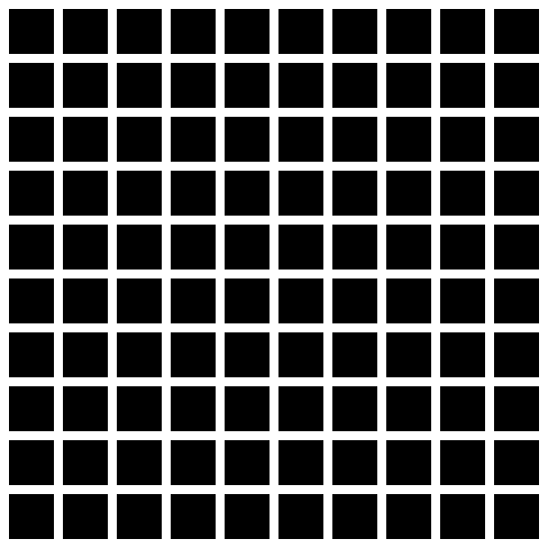
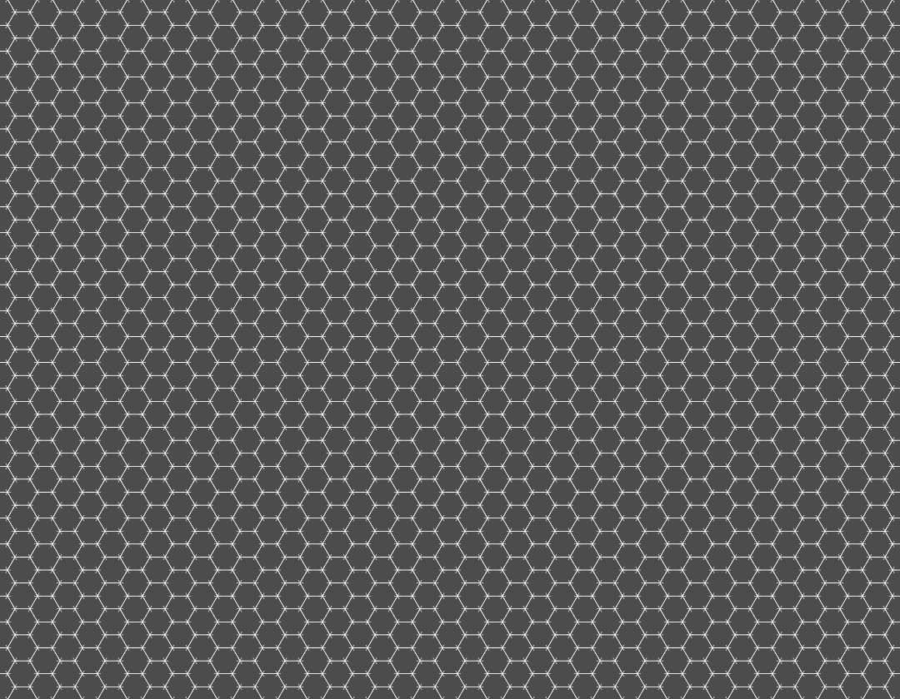
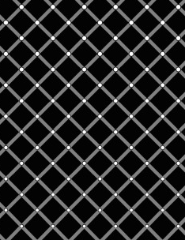

% Programming for Cognitive and Brain Sciences (notes for the Cogmaster's PCBS course) 
% Christophe Pallier
% Fall 2018

This document is available at [https://chrplr.github.io/PCBS](https://chrplr.github.io/PCBS). Its source as well as the course materials is on github, at [http://www.github.com/chrplr/PCBS](http://www.github.com/chrplr/PCBS); to download them, open a terminal (`git bash` under Windows) and type:

```
        git clone https://github.com/chrplr/PCBS
```

I encourage you to try and do the [exercises](exercices.md).

I have created a [discussion forum on slack](https://cogmaster-pcbs.slack.com)  Please [join](
 https://join.slack.com/t/cogmaster-pcbs/shared_invite/enQtNDUzNDk0NTMyNjk0LTM0YzVhMmI1YjU3ZjRhMjNmZDRjMmVmYzYwYWJiZjA1YTE2MjNkYjE3MzAyNGU3OWI0MTA3NGMyOTFiYmM3NzU) !


<!-- markdown-toc start - Don't edit this section. Run M-x markdown-toc-refresh-toc -->
**Table of Contents**

- [License](#license)
- [Objective](#objective)
- [Prerequisites:](#prerequisites)
- [Resources](#resources)
    - [Manipulations:](#manipulations)
    - [Stimulus/Experiment generation modules](#stimulusexperiment-generation-modules)
    - [Data analyses, Statistics](#data-analyses-statistics)
    - [Simulations](#simulations)
    - [Relevant Books](#relevant-books)
- [Creating static visual stimuli](#creating-static-visual-stimuli)
- [Creating dynamic visual stimuli](#creating-dynamic-visual-stimuli)
- [Creating and playing sounds](#creating-and-playing-sounds)
- [Experiments](#experiments)
    - [Simple reaction times](#simple-reaction-times)
    - [Stroop Effect](#stroop-effect)
    - [Lexical Decision Task](#lexical-decision-task)
    - [More examples of experiments with expyriment.org](#more-examples-of-experiments-with-expyrimentorg)
- [Lexical Frequencies and Zipf law](#lexical-frequencies-and-zipf-law)
    - [-](#-)
    - [Neural networks](#neural-networks)
    - [Automata](#automata)
- [Simulations](#simulations-1)

<!-- markdown-toc end -->

# License

All documents in this repository are distributed under the [Creative Commons Attribution-ShareAlike 4](https://creativecommons.org/licenses/by-sa/4.0/). The code is distributed under the [GPL v3 LICENSE](https://www.gnu.org/licenses/gpl-3.0.en.html).


# Objective

The purpose of this lecture is to get students to learn to write clean and simple programs in order to solve tasks that are typically encountered in cognitive or neurosciences (data manipulation and analysis, creation of stimuli, programming of real time experiments, simulations...).


# Prerequisites: 

* knowledge of basic programming concepts expressions, instructions, variables, lists, dictionaries, tests (if..then..else), string manipulations, loops (while and for), functions (call and definition), file input/output operations ) and their implementation in Python 3. 

  Complete beginners should look at [Code Academy's _Learn Python_ module](https://www.codecademy.com/learn/learn-python). 
  
  Then, there is an excellent online course [Python 3 : des fondamentaux aux concepts avancés du langage](https://www.fun-mooc.fr/courses/course-v1:UCA+107001+session02/eb326b60bec3461ba2621fd4d6bd95b8/). 
  
  Good books to start with Python include [_Automate the boring stuff_](http://automatetheboringstuff.com/), [_Think Python_](http://greenteapress.com/thinkpython2/), [_Invent Your Own Computer Games with Python_ (4th Edition)](https://inventwithpython.com/invent4thed/), [_Apprendre à programmer avec Python 3_](http://inforef.be/swi/python.htm). 
   
* know how to edit a text file (with a text editor like [atom](https://atom.io/)), how to open a terminal, navigate the directory structure with 'cd', execute a .py script and launch [ipython](http://ipython.org). A very useful read is [_Learning the bash shell_](http://www.linuxcommand.org/lc3_learning_the_shell.php#contents).

* know the basic usage of [Git](https://www.gitbook.com/), that is the commands`git clone, git pull, git init, git add, git status, git commit`.
        
    * see [tools-for-reproducible-science.md]
    * <https://product.hubspot.com/blog/git-and-github-tutorial-for-beginners>
    * <https://git-scm.com/book/en/v2/Getting-Started-Git-Basics>

# Resources

## Manipulations:

_Automate the boring stuff with Python_ by Al Sweigart (<http://automatetheboringstuff.com/>) is a great book to learn to manipulate files, extracting information from web pages, etc.

## Stimulus/Experiment generation modules

* <http://www.pygame.org>
     - Tutorial "PyGame Drawing Basics": <https://www.cs.ucsb.edu/~pconrad/cs5nm/topics/pygame/drawing/> 
* <http://www.lexique.org>
* <http://www.expyriment.org> (my favorite)
     - Tutorial: <https://docs.expyriment.org/Tutorial.html>
* <http://psychopy.org>
     - Tutorial "Programming with PsychoPy": <https://www.socsci.ru.nl/wilberth/nocms/psychopy/print.php>
* <http://psychtoolbox.org/> (Matlab only)

## Data analyses, Statistics

* Modules: numpy, scipy, pandas, seaborn, statsmodel, sklearn
   - Data manipulation: <http://pandas.pydata.org/pandas-docs/stable/tutorials.html>
   - Plotting:
      - <http://matplotlib.org/users/pyplot_tutorial.html>
      - <https://seaborn.pydata.org/tutorial.html>

* _Scipy Lecture Notes_: <http://www.scipy-lectures.org/>
* _Think Stats_ by Allen B. Downey: <http://greenteapress.com/thinkstats2/>
* _Python Data Science Handbook_ by Jake VanderPlas: <https://jakevdp.github.io/PythonDataScienceHandbook>


## Simulations

* [_Think Complexity_](http://greenteapress.com/wp/think-complexity-2e/) by Allen B. Downey 
* The [Brian spiking neural network simulator](http://briansimulator.org/) 
* [Deep Learning for Natural Language Processing with Pytorch](https://pytorch.org/tutorials/beginner/deep_learning_nlp_tutorial.html)


## Relevant Books

- [_Programming Visual Illusions for Everyone_](https://www.programmingvisualillusionsforeveryone.online/) by Marco Bertamini: 
- _Neural Data Science: A Primer with MATLAB and Python_ by von Erik Lee Nylen and Pascal Wallisch
- _Matlab for Brain and Cognitive Scientists_ and _Analyzing neural time series data_ by Mike X Cohen
- [_Python in Neuroscience_](https://www.frontiersin.org/research-topics/8/python-in-neuroscience)
- _Modeling Psychophysical Data in R_ by Kenneth Knoblauch & Laurence T. Maloney

---

# Creating static visual stimuli

We are going to use [pygame](http://www.pygame.org). You can read a [quick introduction on drawing with pygame](https://www.cs.ucsb.edu/~pconrad/cs5nm/topics/pygame/drawing/).

0. Open the script [square.py](visual-illusions/square.py) that generates and displays a square.

1. Copy the script and rename it `circle.py`, then modify it to display a red circle 

2. Make another of the script and modify it to display Kanizsa's figures:

   

   

  (to know more, google 'illusory contours')

  Check [my solution](visual-illusions/kanizsa-square.py) 

3. Copy this script and modify it to display the [Herman grid](https://en.wikipedia.org/wiki/Grid_illusion)

   

 Check [my solution](visual-illusions/grid.py)


4. Copy this script and modify it to generate the static [Ebbinghaus–Titchener stimulus](http://www.abc-people.com/illusion/illusion-3.htm#axzz5SqeF15yC). You can also watch [this video](https://www.youtube.com/watch?v=hRlWqfd5pn8).

   

5. Honeycomb and Extinction illusions.

   

   - Watch [this video](https://www.youtube.com/watch?v=fDBYSFDXsuE)
   - Check out [Bertamini, Herzog, and Bruno (2016). “The Honeycomb Illusion: Uniform Textures Not Perceived as Such.”](https://doi.org/10.1177/2041669516660727.
 https://www.ncbi.nlm.nih.gov/pmc/articles/PMC5030753/pdf/10.1177_2041669516660727.pdf)
   - Program the stimulus of the extinction illusion (the lines can be horizontal and vertical rather than oblique)
     
  
 
  Check [my solution](visual-illusions/Honeycomb.py)
  
   - Try to program the honeycomb stimulus above (optional). A implementation with psychopy is available from (Bertamini's web site)[https://www.programmingvisualillusionsforeveryone.online/scripts.html]
    
 
# Creating dynamic visual stimuli

* Wertheimer line-motion illusion. Check out [Jancke et al (2004) Imaging cortical correlates of
illusion in early visual cortex](http://www.cnbc.cmu.edu/cns/papers/nature02396.pdf). Program the stimulus. Compare with [visual-illusions/line-motion.py](visual-illusions/line-motion.py)

* Read about the [Flash-lag illusion](https://en.wikipedia.org/wiki/Flash_lag_illusion). Program the stimulus. Compare with [v]isual-illusions/flash-lag.py](isual-illusions/flash-lag.py)


# Creating and playing sounds

0. Install the _simpleaudio_ module if it is not already installed on your computer (check with ipython: `import simpleaudio`), :
    ```
    pip install simpleaudio
    ```

   Run the quick check with ipython:

    ```
    import simpleaudio.functionchecks as fc
    fc.LeftRightCheck.run()
    ```

    Check out [simpleaudio tutorials](https://simpleaudio.readthedocs.io/en/latest/tutorial.html)


1. run `sound_synth.py`, look at the code.

2. Take a mono sound and create a stereo sound by progressively dephasing the two channels.

3. Create rhythmic stimuli as described in [Povel and Essen (1985) _Perception of Temporal Patterns_](http://www.cogsci.ucsd.edu/~creel/COGS160/COGS160_files/PovelEssens85.pdf)


# Experiments

## Simple reaction times

1. Write a script that presents a series of trials in which a dot or a cross is presented at the center of the screen and the participant must click on the mouse as quickly as possible. The reaction times must be recorded in a file for further analyses.

    - Here is a [solution using pygame](reaction-times/simple-detection-visual-pygame.py). Run it and check `reaction_times.csv`. 
    - Here is a [solution using expyriment](reaction-times/simple-detection-visual-expyriment.py). 
    
    Run the previous script. Check the results file in the folder `data`. Launch ipython in the `data` folder and type:
    
    ```
    import pandas as pd
    d = pd.read_csv('simple-detection... .xpd', comment='#')
    d.RT.mean()
    d.RT.std()
    d.RT[1:].mean()
    
    import matplotlib.pyplot as plt
    plt.hist(d.RT)
    ```

3. Read <https://docs.expyriment.org/Tutorial.html> to understand the basic pinciples of expyriment. See `PCBS/expyriment_template.py``

4. Modify `simple-detection-visual-expyriment.py` to play a short sound (`click.wav`) in lieu of displaying a cross. Thus you have a simple detection audio experiment. 

5. Modify the script to have 3 blocks of trials: one in which the target is visual, one in which it is audio, and one in which it is randomly visual or auditory. Are we slowed down in the latter condition?

6. Program [Posner's attentional cueing task](https://en.wikipedia.org/wiki/Posner_cueing_task) See solution in [Posner-attention/posner_task.py](Posner-attention/posner_task.py).


## Stroop Effect

The [Stroop Effect](https://en.wikipedia.org/wiki/Stroop_effect) demonstrates the automaticity of reading. 
Write a python script to create 4x8 cards for the task, avoiding repetitions of colors.
 

 
  You can read a tutorial on [how to display text with pygame](https://nerdparadise.com/programming/pygame/part5)
 
   * After trying to program it yourself, you can compare with [my solution](Stroop-effect/create_stroop_cards.py)

   * Run [stroop_task.py](Stroop-effect/stroop_task.py) and check the naming times in `data`. Compute the average reading times as a function of the language (you can use R or Python).
   
## Lexical Decision Task

In a lexical decision experiment, a string of characters is flashed at the center of the screen and the participant has to decide if it is  real word or not, indicating his/her decision by pressing a left or right button. Reaction time is measured from the word onset, providing an estimate of the speed of word recognition. 

   * Using [lexical-decision/select-words-from-lexique.py] as an example, select 20 high frequency nouns, 20 low frequency nouns, 20 high frequency verbs and 20 low frequency verbs, from Lexique382.txt (which can be download from <http://www.lexique.org>). They must all have a length of 5 to 8 characters. 
   * generate 50 pseudowords using either [Lexique tools](http://www.lexique.org/toolbox/toolbox.pub/) or  [Wuggy](http://crr.ugent.be/programs-data/wuggy)
   * Program a lexical decision using expyriment.
   * Run it and compute the average decision times using pandas

## More examples of experiments using expyriment.org

* See <http://docs.expyriment.org/old/0.9.0/Examples.html>
* See <https://www.github.com/chrplr/audiovis> : a general audio visual stimulus presentation script using expyriment
* Fork <https://github.com/expyriment/expyriment-stash> and contribute by adding new scripts!


# Lexical Frequencies and Zipf law

* The script (word-count.py])[Zipf/word-count.py] computes the distribution of frequencies of occurences in a list of words. Use it to compute the distribution of word frequencies in [_Alice in Wonderland_](http://www.umich.edu/~umfandsf/other/ebooks/alice30.txt).

Note: To remove the punctuation, you can use the following function:

```
    import string
    def remove_punctuation(text):
        punct = string.punctuation + chr(10)
        return text.translate(str.maketrans(punct, " " * len(punct)))
```

* Zipf law states that the product rank X frequency is roughly constant. This 'law' was discovered by Estoup and popularized by Zipf. See  <http://en.wikipedia.org/wiki/Zipf%27s_law>.  Create the Zipf plot for the text of _Alice in Wonderlang_ showing, on the y axis, the log of the frequency and on the x axis the word rank (sorting words from the most frequent to the least frequent). 

* Generate random text (each letter from a-z being equiprobable, and the spacecharacter being 8 times more probable) of 1 million characters. Compute the frequencies of each 'pseudowords' and plot the rank/frequency diagram.

To know more about lexical frequencies:

* check **google ngrams** at <https://books.google.com/ngrams>. (Note that at the bottom of the page, there is a message "Raw data is available for download here"). Read Michel, Jean-Baptiste, Yuan Kui Shen, Aviva P. Aiden, Adrian Veres, Matthew K. Gray, The Google Books Team, Joseph P. Pickett, et al. 2010. “Quantitative Analysis of Culture Using Millions of Digitized Books.” Science, December. <https://doi.org/10.1126/science.1199644.>  (use scholar.google.com to find a pdf copy)

* See Harald Baayen (2001) _Word Frequency Distributions_ Kluwer Academic Publishers.


### Benford law. 

TODO

### Neural networks


### Automata

# Simulations

TODO
